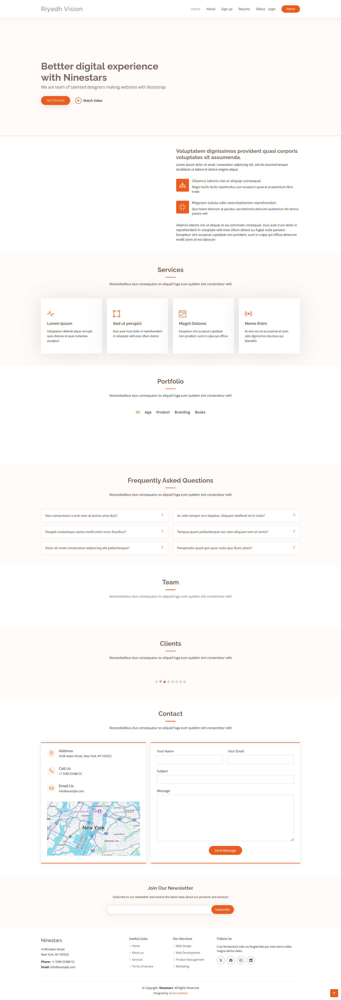
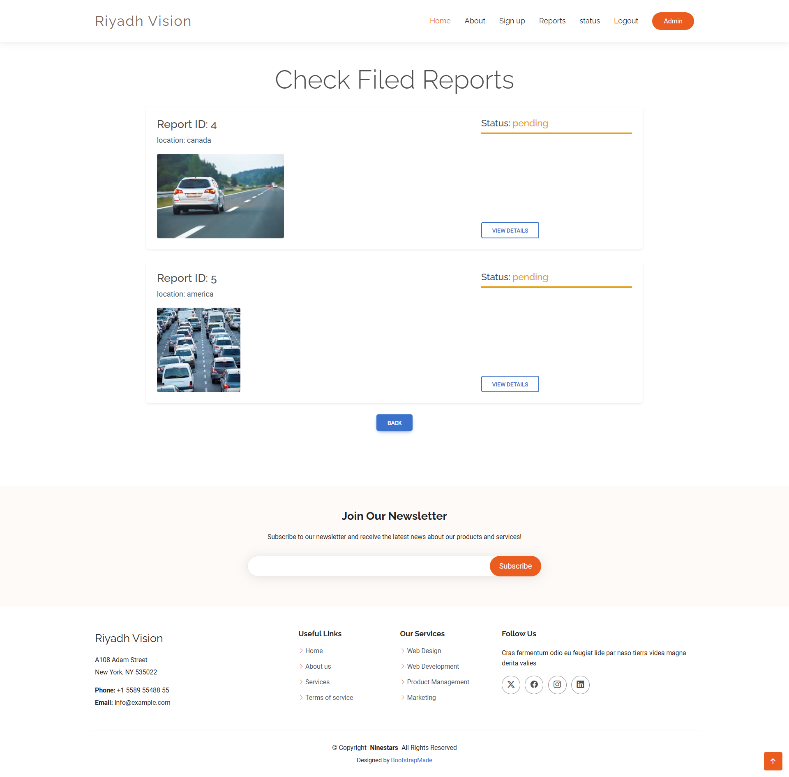

# 🚗 Road Detection AI System

This project is a **Django-based web application** that uses AI to classify car images as either **"On Road"** or **"Off Road"**. The application provides an admin verification system, allowing administrators to review and verify the AI-generated status for each image and decide whether to accept or reject the report. The final status is displayed to the user, providing them with clear and accurate classification details.

## 📌 Features

- **Image Upload**: Users can upload images of vehicles for classification.
- **AI Classification**: An integrated AI model automatically classifies each uploaded image as "On Road" or "Off Road."
- **Admin Verification**: Admins can review the AI classifications and either confirm or override the AI's decision.
- **Report Management**: Admins can accept or reject the final report based on the AI classification and their verification.
- **User Dashboard**: Users can view the status of their uploaded images, including whether the report was accepted or rejected by the admin.
